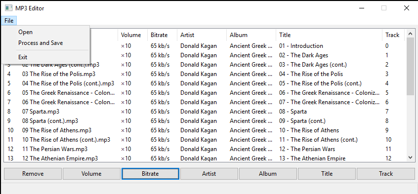

# MP3-Editor
MP3-Editor is a wrapper around FFmpeg (https://ffmpeg.org/) command-line multimedia editor. It uses Python to build a GUI that simplifies the use of FFmpeg native command-line interface.

The editor is supposed to be used with audio files containing audio books and lectures without any particular attention to the quality of the produced MP3 files (the only quality concern is the size of the output files). Thus it **should not be used to edit _music files_ or any other files where the audio quality is of prime concern**. For such purpose one can refer to e.g. MP3gain software (http://mp3gain.sourceforge.net/).

The editor was built and tested in Windows 10 environment with MP4 and MP3 files while it should be easily transferable to Linux and MacOS environments and other multimedia formats supported by FFmpeg.

## Functionality
Currently the editor can process MP4 and MP3 files.

In the case of video MP4 files the audio track is extracted and converted to MP3.

The editor allows one to adjust (increase) the volume level of the audio files, their (average) bitrate, as well as to edit some of the MP3 tags such as the artist name, the album name, the title of the track and the track number.

Once the desired modifications of the files are entered, the MP3 file can be processed and saved in the folder chosen by user.

A snapshot of the MP3 Editor's GUI:

## Installation and dependences
Properly installed FFmpeg is required. The latest version of FFmpeg can be downloaded from the program's home page https://ffmpeg.org/download.html#build-windows.

After installation the FFmpeg must be aded to Windows PATH environment. This can be done e.g. as follows. First, navigate to Advanced System Information window. The quickest way to get ther is to right-click the My Computer shortcut and select Properties and than click on Advanced System Information. In the opened window click on Environment Variables. This will open a new window where you can choose to edit either the global PATH environment or the PATH environment of the current user. Choose either of them (e.g. global environment), select "Path" row and click Edit. The “Edit environment variable” window will appear. Here, you can click “New” and enter the path to the bin directory in the FFmpeg installation folder.

The MP3 Editor itself can be used either as a Python script or as a precompiled exe file. To run the script a Python v.3.7 (https://www.python.org/) or newer is required, with wxPython GUI module (https://wxpython.org/) v.4.0.4 or newer installed. For the use of the precompiled exe file no other requirement than properly installed FFmpeg is needed.
